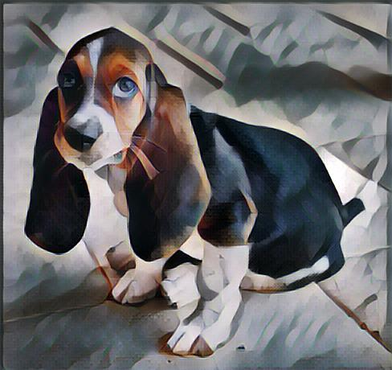

## Fast Style Transfer Exercise

### Step 1. Find an image to stylize.

Use a web browser to download your favorite small [image](https://upload.wikimedia.org/wikipedia/commons/a/af/Cara_de_quem_caiu_do_caminh%C3%A3o..._%28cropped%29.jpg) to your laptop. **Tip:** to begin, use an image of about 640x480 or smaller. You can try larger images later, depending on the speed of your machine.

### Step 2. Share the image with the running container

*If you are running locally*

Save the image to the shared folder you mounted when you started the Docker container. If you used the default directory in the [instructions](install-local.md), this will be ```~/shared```.

*If you are running in the Cloud*

Upload the image through the notebook server UI as described in the [cloud instructions](install-cloud.md).

### Step 3. Understand the example script

If you run these commands on the terminal connected to the running docker container:

```
# cd /workshop/scripts
# cat fast_style.sh
```

you will see an example script you can use to run Fast Style Transfer on an image. Here's what it looks like:

```
python evaluate.py --checkpoint /workshop/fast-style-transfer/models/udnie.ckpt --in-path /workshop/sample_images/basset.jpg --out-path /workshop/shared/basset_stylized.jpg
```

And here are the arguments:

* --checkpoint : full path to the pre-trained model for the style you will use. 

* --in-path : full path to the input image.

* --out-path : full path where the output image will be written. Notice this points to ```/workshop/shared``` inside the container, which should be mapped to the shared directory ```~/shared``` on your laptop.

To begin, run this script without changing any of the arguments:

```# sh fast_style.sh```

This will stylize a sample image included with the container:

<p align="center"></p>

In the style of this painting:
<p align="center"></p>

*If you are running locally*

If everything is working properly, when it finishes, you should see a stylized image of a basset appear in ```~/shared``` on your laptop. If you don't see the image, check that you properly mounted a shared directory by referring to the [Docker instructions](install-local.md). 

*If you are running on the Cloud*

If you are running in the Cloud, you will see a new file inside the ```shared``` directory in the notebook server UI (you will have to refresh your browser to see it).

<p align="center"></p>

### Step 4. Modify the script to work with your input image
Now it's time to stylize your own image. 

*If you are running locally*

For example, imagine your image is saved as ```cat.jpg``` inside the shared directory ```~/shared```  on your laptop. Then you would run these commands on the terminal connected to the Docker container to produce an image called ```cat_styled.jpg``` inside that same folder.

```
# cd /workshop/fast-style-transfer
# python evaluate.py --checkpoint /workshop/fast-style-transfer/models/udnie.ckpt --in-path /workshop/shared/cat.jpg --out-path /workshop/shared/cat_styled.jpg
```

*If you are running on the Cloud*

First, upload your image to the ```shared``` folder using the notebook server's UI, then run the above command.

### Step 5. Try a different style

Want to change the style? The author of the github repo we're using has helpfully provided several pre-trained models for different styles that you can choose from. These are already included in the Docker image.

To see the available models, run this command from the terminal connected to the container:

```# ls /workshop/fast-style-transfer/models ```

You will see a list of models:

* la_muse.ckpt
* rain_princess.ckpt
* scream.ckpt
* udnie.ckpt
* wave.ckpt
* wreck.ckpt

You can see what the corresponding paintings look like by visiting [this site](https://github.com/lengstrom/fast-style-transfer/tree/master/examples/style).

To select a different style, change this argument ```--checkpoint /workshop/fast-style-transfer/models/udnie.ckpt``` to point to any of those files, and run the style transfer command again.

### Share your favorites
Did you produce an image you really like? Consider sharing it on social, using the hashtag ```#WTM17```.

### For more details
See [this page](https://github.com/lengstrom/fast-style-transfer/).

## Next steps
Want more? Head on over to [Magenta](magenta-style-transfer.md).