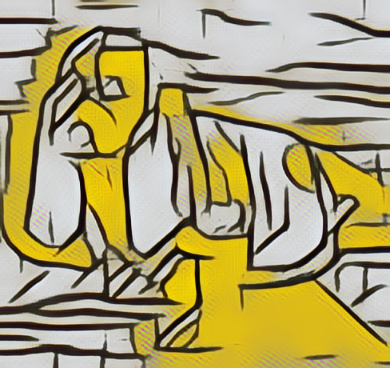
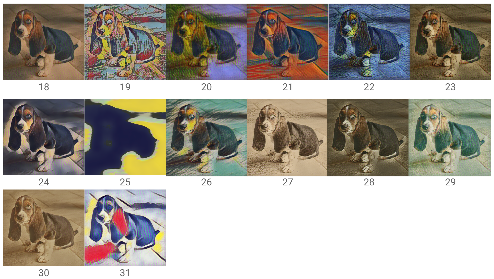
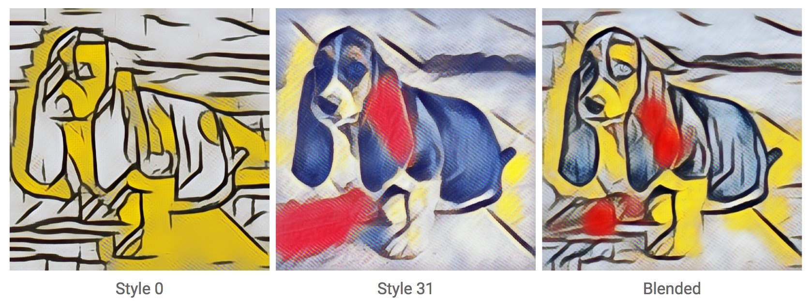

## Project Magenta - Style Transfer Exercise

These instructions assume you're familiar using the workshop Docker image ([locally](install-local.md), or in the [Cloud](install-cloud.md)), and that you have completed the previous [exercise](fast-style-transfer.md) to learn the mechanics of copying images back and forth between your laptop and the running container.

In this exercise, you'll experiment with blending different styles and images.

## Step 1. Find an image to stylize

*If you are running locally*

As before, download an image and save it to the shared directory on your laptop. There are also sample images you can use inside the container at ```/workshop/sample-images```. We recommend beginning with relatively small images, of around 640x480.

*If you are running on the Cloud*

As before, upload an image using the Notebook Server UI.

## Step 2. Understand the example script

<p align="center"></br>Input image</p>

<p align="center"></br>Output image, using style 0</p>

```
image_stylization_transform \
      --num_styles=32 \
      --checkpoint=/workshop/magenta/multistyle-pastiche-generator-varied.ckpt \
      --input_image=/workshop/sample-images/basset.jpg \
      --which_styles="[0]" \
      --output_dir=/workshop/shared/ \
      --output_basename="basset"
```

To get started, the only argument you'll have to change is ```--input_image``` to point to your image in the shared directory. 

*If you are running locally*

Recall, the shared directory is mounted as ```/workshop/shared```, so if your image is called ```cat.jpg```, then you'll want to change ```--input_image``` to ```/workshop/shared/cat.jpg```).

*If you are running on the Cloud*

Upload an image to the shared directory using the Notebook Server UI. This is mounted inside the container as ```/workshop/shared```.

First, try running this script with the default arguments, and verify you see a stylized image appear in ```~/shared``` when it completes. *If you are running on the Cloud* you will have to refresh your web browser after the script completes. Next, change the ```input-image``` to point to your image, and verify you can stylize it.

## Try different styles
Now it's time to use different styles. You can see images of all the available styles in the pre-trained varied mode [here](https://goo.gl/1UDjBE).

<p align="center"></br>Style 0 -- 17</p>

<p align="center"></br>Styles 18 -- 31</p>

Experiment with different styles and input images.

## Blend styles
You can also blend styles using a weighted combination. This enables you to specify how much of each style you'd like! Here's the syntax. The only argument you'll need to change from above is ```--which-styles```.

For example:

```
-- which_styles="{0:0.5,31:0.5}
```

Notice the format for this argument is a Python dictionary of Style -> Weight.

This will equally blend styles 0 and 31, each with a weight of 0.5 (note, these weights aren't normalized). You can blend any number of styles at the same time.

<p align="center"></br>Weighted combination of styles 0 and 31</p>

Experiment with different images and styles.

### Share your favorites
Did you produce an image you really like? Consider sharing it on social, using the hashtag ```#WTM17```.

### For more details
See [this page](https://github.com/tensorflow/magenta/tree/master/magenta/models/image_stylization).

### Next steps
Why not experiment with generating [music](https://github.com/tensorflow/magenta)? 